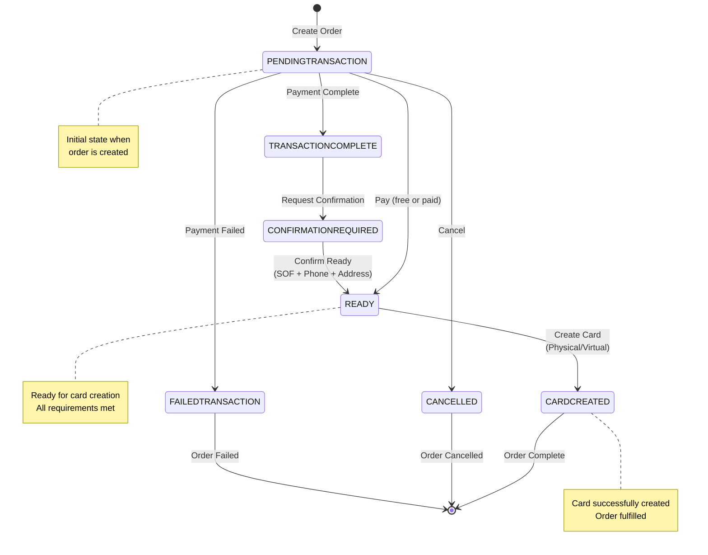

Below is the complete state transition diagram and detailed explanations.

### State Transition Diagram




### Card Order States

#### Core States

**`PENDINGTRANSACTION`** - *Initial State*
- **Description**: Order created, awaiting payment or confirmation
- **Next States**: `READY`, `TRANSACTIONCOMPLETE`, `CANCELLED`, `FAILEDTRANSACTION`
- **User Actions**: Attach transaction, confirm payment, cancel order

**`TRANSACTIONCOMPLETE`** - *Payment Processed*
- **Description**: Payment transaction completed but requires additional verification
- **Next States**: `CONFIRMATIONREQUIRED`
- **System Actions**: Automatic transition when additional verification needed

**`CONFIRMATIONREQUIRED`** - *Verification Needed*
- **Description**: Additional user verification required (SOF, phone, address)
- **Next States**: `READY`
- **Requirements**: Phone verified, SOF completed, address provided

**`READY`** - *Ready for Card Creation*
- **Description**: All requirements met, ready to create physical/virtual card
- **Next States**: `CARDCREATED`
- **User Actions**: Create card with PIN (physical) or without PIN (virtual)

#### Terminal States

**`CARDCREATED`** - *Success*
- **Description**: Card successfully created and ready for use
- **Next States**: None (terminal state)
- **Note**: Virtual cards are immediately active; physical cards need activation

**`CANCELLED`** - *Cancelled*
- **Description**: Order cancelled by user or system
- **Next States**: None (terminal state)
- **Note**: Only possible from `PENDINGTRANSACTION` state

**`FAILEDTRANSACTION`** - *Payment Failed*
- **Description**: Payment processing failed
- **Next States**: None (terminal state)
- **Note**: User needs to create a new order

### Transition Rules

<Steps titleSize="h3">
<Step title="Pay Transition">
`PENDINGTRANSACTION` → `READY`:
- Free card: `totalAmountEUR === totalDiscountEUR`
- Paid card: Valid EURe payment to correct address
- Transaction hash validation (if required)
</Step>

<Step title="Request Confirmation">
`TRANSACTIONCOMPLETE` → `CONFIRMATIONREQUIRED`:
- Triggered when additional user verification is needed
- System determines extra checks required
</Step>

<Step title="Confirm Ready">
`CONFIRMATIONREQUIRED` → `READY`:
- User phone verified
- Source of Funds (SOF) completed
- Valid shipping address (for physical cards)
</Step>

<Step title="Create Card">
`READY` → `CARDCREATED`:
- KYC approved
- Risk score: Green or Orange
- For physical cards: Encrypted PIN required
- For virtual cards: No PIN needed
</Step>

<Step title="Cancel">
`PENDINGTRANSACTION` → `CANCELLED`:
- Only from `PENDINGTRANSACTION` state
- User-initiated or admin-initiated
</Step>
</Steps>

### Error Handling

When implementing card order, consider these scenarios:

**Invalid Transitions**
Will throw TransitionError
- Trying to cancel from READY state
- Attempting to create card from `PENDINGTRANSACTION`
- Any transition not defined in the state machine


**Common Error Scenarios**
- **Payment Issues**: Transaction hash already used, insufficient payment
- **User Requirements**: Missing KYC, unverified phone, missing address
- **System Issues**: Payment processor errors, card creation failures

### Implementation Example

```javascript
// Check current order state before taking action
const handleOrderAction = async (order, action) => {
  switch (order.status) {
    case 'PENDINGTRANSACTION':
      if (action === 'pay') {
        await confirmPayment(order.id);
      } else if (action === 'cancel') {
        await cancelOrder(order.id);
      }
      break;

    case 'READY':
      if (action === 'createCard') {
        await createCard(order.id, { setPin: !order.virtual });
      }
      break;

    case 'CARDCREATED':
      // Order complete - handle card activation if needed
      break;

    default:
      throw new Error(`Cannot perform ${action} on order with status ${order.status}`);
  }
};
```

### Cancellable States

Orders can only be cancelled from specific states. Use the `CANCELLABLE_ORDER_STATUSES` constant:

```javascript
const CANCELLABLE_ORDER_STATUSES = [
  'PENDINGTRANSACTION',
  'TRANSACTIONCOMPLETE',
  'CONFIRMATIONREQUIRED',
  'FAILEDTRANSACTION'
];
```

<Warning>
**State Validation**: Always validate the current order state before attempting transitions. Invalid transitions will throw a `TransitionError` and return HTTP 422 status code.
</Warning>
