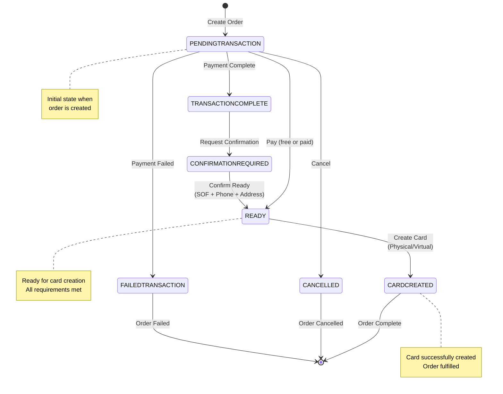

## Create Physical Card Process 


<Steps titleSize="h3">
<Step title="Create a Card Order">


[This endpoint creates a new `CardOrder` with the status of `PENDINGTRANSACTION`](/api-reference/card-order/create-a-new-card-order): 

```bash cURL
curl -X POST /api/v1/order/create
```

The Card Order is created with the following data:

- A shipping address can be specified by filling the `shippingAddress` field, see [endpoint specifications](/api-reference/card-order/create-a-new-card-order). If not set, the KYC address will be used for shipping.
- The total amount to be paid is set in EURe. The amount is 30.23.
- A coupon code can be applied to reduce the amount to be paid, either at signup or in the next step

</Step>
<Step title="(Optional) Attach a Coupon">

[This endpoint attaches a coupon to the `CardOrder` with `orderId`](/api-reference/card-order/attach-a-coupon-to-a-card-order):

```bash cURL
curl -X POST /api/v1/order/{orderId}/attach-coupon
```

The coupon needs to be valid, otherwise an error is thrown.
If the user has a coupon code both from the signup, and from this step, the one from the signup takes precedence.

</Step>
<Step title="(Optional) Attach an on-chain transaction">

<Note>
This is only needed if the card is not free. If `CardOrder.totalAmountEUR` is the same as the `CardOrder.totalDiscountEUR` then the card is considered free.
</Note>

[This endpoint allows setting a transaction hash to the specified `orderId`](/api-reference/card-order/attach-an-on-chain-transaction-to-a-card-order).

```bash cURL
curl -X PUT /api/v1/order/{orderId}/attach-transaction \
-d '{
  "transactionHash": "0x..."
}'
```

The transaction can only be used once across all card orders.

</Step>
<Step title="Confirm the payment was performed">

<Warning>
This endpoint must be called even if the card is free. It moves the card order to the `READY` status.
</Warning>

[To confirm the payment call this endpoint](/api-reference/card-order/marks-a-card-order-as-paid):

```bash cURL
curl -X PUT /api/v1/order/{orderId}/confirm-payment
```

The conditions for the payment are:

- In order to call this endpoint, the `CardOrder.status` needs to be `PENDINGTRANSACTION`.
- If the card is not free, we check if a payment was done. 
  - Token used for payment needs to be EURe `0xcB444e90D8198415266c6a2724b7900fb12FC56E`.
  - Payment was done to `0x3D4FD6a1A7a1382ae1d62C3DD7247254a0236847`.
  - The respective EURe amount was paid in that transaction hash (partial transfers are not supported).

If all the conditions above are met, the `CardOrder.status` is set to `READY`.
</Step>
<Step title="Create the Physical Card">
[Finally, you can create the Physical Card](/api-reference/card-order/create-a-card-out-of-a-card-order): 

```bash cURL
curl -X POST /api/v1/order/:orderId/create-card
```

When successful, this endpoint returns the `cardToken` from the newly created card.

In order to create a `Card` out of a `CardOrder` the following conditions need to be met:

- No cards were created out of this `orderId`.
- User needs to have a verified phone number.
- User needs to have a name set.
- User needs to be from a supported country.
- User address needs to be set.
- User needs to have an approved KYC.
- The risk score needs to be Green or Orange based on the user's answers to the Source of funds questionnaire.
- User needs to have the shipping details for the physical card order set.
  - The shipping details can be different from the KYC address, as long as it is in the same country.
  - Virtual cards do not require a shipping address.
- The embossed name for the card needs to be set.
</Step>
<Step title="Set the Card PIN using the Partner Secure Elements (PSE)">

The card PIN should be set immediately after the card is created via the Partner Secure Elements (PSE).
Use the `cardToken` returned from the previous endpoint to set the PIN.
If a PIN is not provided upon creation, a random one will be assigned. 
Changing this randomly assigned PIN requires the user to visit an ATM. Refer to the **[card PINs section](/cards#card-pins)** to learn more about the online and offline PINs.

For detailed instructions about how to change the PIN, please refer to the [PSE SDK documentation](https://www.npmjs.com/package/@gnosispay/pse-sdk).
</Step>
</Steps>

## Card Order State Transitions

Understanding the card order state machine is crucial for handling different scenarios in your application. Below is the complete state transition diagram and detailed explanations.

### State Transition Diagram




### Card Order States

#### Core States

**`PENDINGTRANSACTION`** - *Initial State*
- **Description**: Order created, awaiting payment or confirmation
- **Next States**: `READY`, `TRANSACTIONCOMPLETE`, `CANCELLED`, `FAILEDTRANSACTION`
- **User Actions**: Attach transaction, confirm payment, cancel order

**`TRANSACTIONCOMPLETE`** - *Payment Processed*
- **Description**: Payment transaction completed but requires additional verification
- **Next States**: `CONFIRMATIONREQUIRED`
- **System Actions**: Automatic transition when additional verification needed

**`CONFIRMATIONREQUIRED`** - *Verification Needed*
- **Description**: Additional user verification required (SOF, phone, address)
- **Next States**: `READY`
- **Requirements**: Phone verified, SOF completed, address provided

**`READY`** - *Ready for Card Creation*
- **Description**: All requirements met, ready to create physical/virtual card
- **Next States**: `CARDCREATED`
- **User Actions**: Create card with PIN (physical) or without PIN (virtual)

#### Terminal States

**`CARDCREATED`** - *Success*
- **Description**: Card successfully created and ready for use
- **Next States**: None (terminal state)
- **Note**: Virtual cards are immediately active; physical cards need activation

**`CANCELLED`** - *Cancelled*
- **Description**: Order cancelled by user or system
- **Next States**: None (terminal state)
- **Note**: Only possible from `PENDINGTRANSACTION` state

**`FAILEDTRANSACTION`** - *Payment Failed*
- **Description**: Payment processing failed
- **Next States**: None (terminal state)
- **Note**: User needs to create a new order

### Transition Rules

<Steps titleSize="h3">
<Step title="Pay Transition">
`PENDINGTRANSACTION` → `READY`:
- Free card: `totalAmountEUR === totalDiscountEUR`
- Paid card: Valid EURe payment to correct address
- Transaction hash validation (if required)
</Step>

<Step title="Request Confirmation">
`TRANSACTIONCOMPLETE` → `CONFIRMATIONREQUIRED`:
- Triggered when additional user verification is needed
- System determines extra checks required
</Step>

<Step title="Confirm Ready">
`CONFIRMATIONREQUIRED` → `READY`:
- User phone verified
- Source of Funds (SOF) completed
- Valid shipping address (for physical cards)
</Step>

<Step title="Create Card">
`READY` → `CARDCREATED`:
- KYC approved
- Risk score: Green or Orange
- For physical cards: Encrypted PIN required
- For virtual cards: No PIN needed
</Step>

<Step title="Cancel">
`PENDINGTRANSACTION` → `CANCELLED`:
- Only from `PENDINGTRANSACTION` state
- User-initiated or admin-initiated
</Step>
</Steps>

### Error Handling

When implementing card order, consider these scenarios:

**Invalid Transitions**
Will throw TransitionError
- Trying to cancel from READY state
- Attempting to create card from `PENDINGTRANSACTION`
- Any transition not defined in the state machine


**Common Error Scenarios**
- **Payment Issues**: Transaction hash already used, insufficient payment
- **User Requirements**: Missing KYC, unverified phone, missing address
- **System Issues**: Payment processor errors, card creation failures

### Implementation Example

```javascript
// Check current order state before taking action
const handleOrderAction = async (order, action) => {
  switch (order.status) {
    case 'PENDINGTRANSACTION':
      if (action === 'pay') {
        await confirmPayment(order.id);
      } else if (action === 'cancel') {
        await cancelOrder(order.id);
      }
      break;

    case 'READY':
      if (action === 'createCard') {
        await createCard(order.id, { setPin: !order.virtual });
      }
      break;

    case 'CARDCREATED':
      // Order complete - handle card activation if needed
      break;

    default:
      throw new Error(`Cannot perform ${action} on order with status ${order.status}`);
  }
};
```

### Cancellable States

Orders can only be cancelled from specific states. Use the `CANCELLABLE_ORDER_STATUSES` constant:

```javascript
const CANCELLABLE_ORDER_STATUSES = [
  'PENDINGTRANSACTION',
  'TRANSACTIONCOMPLETE',
  'CONFIRMATIONREQUIRED',
  'FAILEDTRANSACTION'
];
```

<Warning>
**State Validation**: Always validate the current order state before attempting transitions. Invalid transitions will throw a `TransitionError` and return HTTP 422 status code.
</Warning>