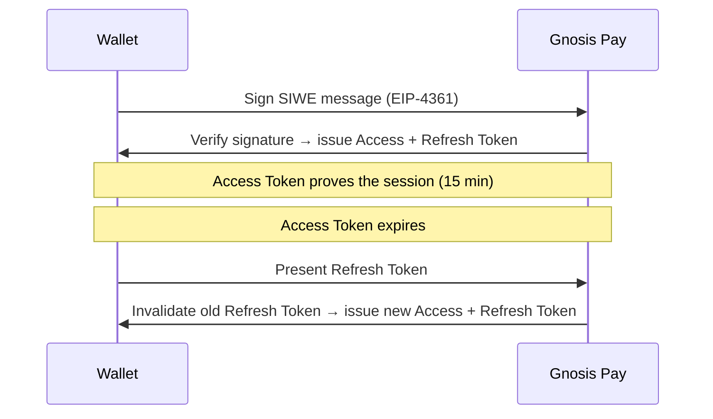

Gnosis Pay authenticates users through **Sign-In with Ethereum (SIWE)** following EIP 4361 in which it verifies a **cryptographic signature** produced by the user's wallet proving control of the address.

Once that signature is verified, the API issues a pair of tokens (**access** and **refresh**) that represent the authenticated session going forward. This page explains the reasoning behind both pieces: why SIWE, and how the token system keeps a session secure without asking the user to sign a message on every request.

## Sign in with Ethereum

SIWE (formalized as **EIP-4361**) defines a standard, human-readable message format that a wallet signs to prove address ownership.

- **Signed message:** The signed message itself states *who* is authenticating, *for which domain*, at *what time*, and often includes a random nonce. The user can visually inspect what they're agreeing to before signing, rather than blindly approving an opaque hash.
- **Domain-bound:** Because the message includes the requesting domain, a signature obtained on `app.example.com` can't be silently replayed against Gnosis Pay's own domain by a malicious site — this is what domain whitelisting on our side enforces.
- **Replay resistance:** The nonce and timestamp in the message mean a captured signature can't be reused indefinitely to mint new sessions.

## Session Management against Auth token

A signature proves identity for a single moment — it doesn't create an ongoing session by itself. So once SIWE verification succeeds, Gnosis Pay issues two tokens that stand in for "this address is authenticated" over time:

| | Access Token | Refresh Token |
|---|---|---|
| **Lifespan** | 15 minutes | 7 days |
| **Format** | Stateless JWT | Opaque random string |
| **Role** | Proves the session on each request | Used only to mint a new access token |
| **Where it should live** | Memory / short-lived storage | Secure, encrypted storage |

## Why tokens rotate

Every time a refresh token is used, it's invalidated and replaced with a new one this is **token rotation**. The old refresh token becomes permanently unusable the moment a new one is issued, even if it hasn't expired yet.

This turns refresh tokens into a kind of tripwire: in normal operation, only one "version" of a session's refresh token is ever valid at a time. If a refresh token is ever used *twice*, once by the legitimate client, once by an attacker who copied it the system can detect that the token has already been consumed and end the session for everyone holding a copy.

<Info>
  For the actual request/response and endpoints to implement this flow, see the [Authentication Guide](/guides/auth-with-siwe).
</Info>
