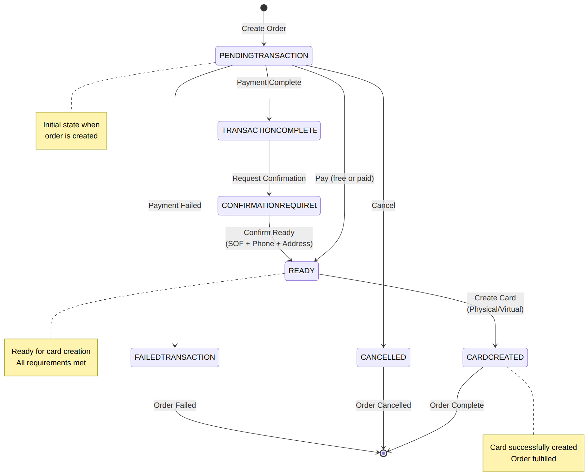

# Cards Orders Flow 

Our card order flow supports both free and paid cards. 
You can provide a `couponCode` if you have one, that will affect the card's price. 


## Create a new Card 

### 1. Create a Card Order

```jsx
POST /api/v1/order/create
```

This endpoint creates a new `CardOrder` with the status of `PENDINGTRANSACTION` .

The Card Order is created with the following data:

- A shipping address can be specified by filling the `shippingAddress` field, see [endpoint specifications](/api-reference/create-a-new-card-order). If not set, the KYC address will be used for shipping.
- The total amount to be paid is set in EURe. The amount is 30.23.
- The `couponCode` applied is taken from the `User.referalCouponCode` . 

### 2. (Optional) Attach a Coupon

```jsx
POST /api/v1/order/{orderId}/attach-coupon
```

This endpoint attaches a coupon to the `CardOrder` with `orderId`.
The coupon needs to be valid else an error is thrown.

We recommend you send the couponCode on the order creation and avoid this step. 

### 3. (Optional) Attach an on-chain transaction

```jsx
PUT /api/v1/order/{orderId}/attach-transaction
```

For the card order, a payment must be performed. This endpoint allows setting a transaction hash to the specified `orderId`.

The transaction can only be used once across all card orders.

:::info 
Calling this endpoint is optional because the card can be free.
::: 


### 4. Confirm the payment was performed

```jsx
PUT /api/v1/order/{orderId}/confirm-payment
```

In order to call this endpoint, the `CardOrder.status` needs to be `PENDINGTRANSACTION` .

This endpoint validates if the card order is free. If `CardOrder.totalAmountEUR` is the same as the `CardOrder.totalDiscountEUR` then the card is considered free. 

#### Successful Payment Conditions

If the card is not free, we check if a payment was done. The conditions for the payment are:

- Token used for payment needs to be EURe `0xcB444e90D8198415266c6a2724b7900fb12FC56E`.
- Payment was done to `0x3D4FD6a1A7a1382ae1d62C3DD7247254a0236847`.
- The respective EURe amount was paid in that transaction hash (partial transfers are not supported).

If the conditions above are met, the `CardOrder.status` is to `READY` .

:::caution 
Even if the card is free, this endpoint needs to be called to move the card order to a `READY` status.
::: 

### 5. Create a Card

```jsx
POST /api/v1/order/:orderId/card
```

In order to create a `Card` out of a `CardOrder` the following conditions need to be met:

- No cards were created out of this `orderId`.
- The risk score needs to be Green or Orange.
- User needs to have a verified phone number.
- User needs to have a name set.
- User needs to be from a supported country.
- User address needs to be set.
- User needs to have an approved KYC.
- User needs to have the shipping details for the physical card order set.
  - The shipping details can be different from the KYC address, as long as it is in the same country.
  - Virtual cards do not require a shipping address.
- The embossed name for the card needs to be set.

:::caution
In order to create a card, users need to set a pin code. 
This pin should be sent encrypted, using Paymentology's public key.
::: 

## Virtual Card Orders

In addition to physical cards, we support virtual card orders. 
The virtual card order follows the same flow as physical cards, but with these differences:

- No shipping address is required
- The card is available immediately after creation (no shipping delay)
- Virtual cards can be used for online transactions immediately
- No PIN required

### 1. Create a Virtual Card Order

```jsx
POST /api/v1/order/create
```

When creating a virtual card order, you need to specify the `cardType` as `VIRTUAL` in the request body:

```json
{
  "virtual": true
}
```

### 2. Create a Virtual Card

```jsx
POST /api/v1/order/:orderId/card
```

:::info
Virtual cards are ideal for users who want immediate access to their card for online transactions without waiting for physical delivery. Once Google and Apple Pay are available in the region, the card can be used for in-person transactions too.
:::

## Card Order State Transitions

Understanding the card order state machine is crucial for handling different scenarios in your application. Below is the complete state transition diagram and detailed explanations.

### State Transition Diagram

{/*
    This diagram is generated using https://mermaid.live

  stateDiagram-v2
  [*] --> PENDINGTRANSACTION : Create Order
  
  PENDINGTRANSACTION --> READY : Pay (free or paid)
  PENDINGTRANSACTION --> TRANSACTIONCOMPLETE : Payment Complete
  PENDINGTRANSACTION --> CANCELLED : Cancel
  PENDINGTRANSACTION --> FAILEDTRANSACTION : Payment Failed
  
  TRANSACTIONCOMPLETE --> CONFIRMATIONREQUIRED : Request Confirmation
  
  CONFIRMATIONREQUIRED --> READY : Confirm Ready<br/>(SOF + Phone + Address)
  
  READY --> CARDCREATED : Create Card<br/>(Physical/Virtual)
  
  CARDCREATED --> [*] : Order Complete
  CANCELLED --> [*] : Order Cancelled
  FAILEDTRANSACTION --> [*] : Order Failed
  
  note right of PENDINGTRANSACTION
      Initial state when<br/>order is created
  end note
  
  note right of READY
      Ready for card creation<br/>All requirements met
  end note
  
  note right of CARDCREATED
      Card successfully created<br/>Order fulfilled
  end note
*/}





### Card Order States

#### Core States

**`PENDINGTRANSACTION`** - *Initial State*
- **Description**: Order created, awaiting payment or confirmation
- **Next States**: `READY`, `TRANSACTIONCOMPLETE`, `CANCELLED`, `FAILEDTRANSACTION`
- **User Actions**: Attach transaction, confirm payment, cancel order

**`TRANSACTIONCOMPLETE`** - *Payment Processed*
- **Description**: Payment transaction completed but requires additional verification
- **Next States**: `CONFIRMATIONREQUIRED`
- **System Actions**: Automatic transition when additional verification needed

**`CONFIRMATIONREQUIRED`** - *Verification Needed*
- **Description**: Additional user verification required (SOF, phone, address)
- **Next States**: `READY`
- **Requirements**: Phone verified, SOF completed, address provided

**`READY`** - *Ready for Card Creation*
- **Description**: All requirements met, ready to create physical/virtual card
- **Next States**: `CARDCREATED`
- **User Actions**: Create card with PIN (physical) or without PIN (virtual)

#### Terminal States

**`CARDCREATED`** - *Success*
- **Description**: Card successfully created and ready for use
- **Next States**: None (terminal state)
- **Note**: Virtual cards are immediately active; physical cards need activation

**`CANCELLED`** - *Cancelled*
- **Description**: Order cancelled by user or system
- **Next States**: None (terminal state)
- **Note**: Only possible from `PENDINGTRANSACTION` state

**`FAILEDTRANSACTION`** - *Payment Failed*
- **Description**: Payment processing failed
- **Next States**: None (terminal state)
- **Note**: User needs to create a new order

### Transition Rules

#### 1. Pay Transition: `PENDINGTRANSACTION` → `READY`
Conditions:
- Free card: totalAmountEUR === totalDiscountEUR
- Paid card: Valid EURe payment to correct address
- Transaction hash validation (if required)


#### 2. Request Confirmation: `TRANSACTIONCOMPLETE` → `CONFIRMATIONREQUIRED`
Triggered when:
- Additional user verification needed
- System determines extra checks required

#### 3. Confirm Ready: `CONFIRMATIONREQUIRED` → `READY`
Requirements:
- User phone verified
- Source of Funds (SOF) completed
- Valid shipping address (for physical cards)

#### 4. Create Card: `READY` → `CARDCREATED`
  Requirements:
- KYC approved
- Risk score: Green or Orange
- For physical cards: Encrypted PIN required
- For virtual cards: No PIN needed

#### 5. Cancel: `PENDINGTRANSACTION` → `CANCELLED`
Conditions:
- Only from `PENDINGTRANSACTION` state
- User-initiated or admin-initiated


### Error Handling

When implementing card order handling, consider these scenarios:

**Invalid Transitions**
Will throw TransitionError
- Trying to cancel from READY state
- Attempting to create card from `PENDINGTRANSACTION`
- Any transition not defined in the state machine
```

**Common Error Scenarios**
- **Payment Issues**: Transaction hash already used, insufficient payment
- **User Requirements**: Missing KYC, unverified phone, missing address
- **System Issues**: Payment processor errors, card creation failures

### Implementation Example

```javascript
// Check current order state before taking action
const handleOrderAction = async (order, action) => {
  switch (order.status) {
    case 'PENDINGTRANSACTION':
      if (action === 'pay') {
        await confirmPayment(order.id);
      } else if (action === 'cancel') {
        await cancelOrder(order.id);
      }
      break;
      
    case 'READY':
      if (action === 'createCard') {
        await createCard(order.id, { setPin: !order.virtual });
      }
      break;
      
    case 'CARDCREATED':
      // Order complete - handle card activation if needed
      break;
      
    default:
      throw new Error(`Cannot perform ${action} on order with status ${order.status}`);
  }
};
```

### Cancellable States

Orders can only be cancelled from specific states. Use the `CANCELLABLE_ORDER_STATUSES` constant:

```javascript
// From @gnosispay/prisma/card-order
const CANCELLABLE_ORDER_STATUSES = [
  'PENDINGTRANSACTION',
  'TRANSACTIONCOMPLETE', 
  'CONFIRMATIONREQUIRED',
  'FAILEDTRANSACTION'
];
```

:::warning State Validation
Always validate the current order state before attempting transitions. Invalid transitions will throw a `TransitionError` and return HTTP 422 status code.
:::

