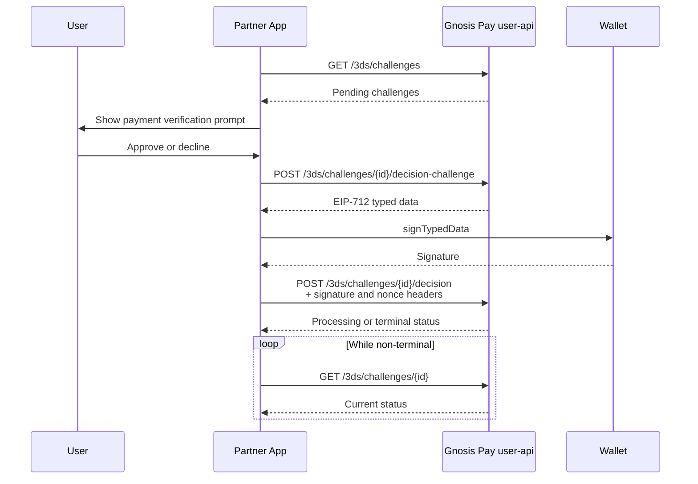

## Overview

In-app 3DS push provisioning means the cardholder approves or declines a card transaction's 3D Secure (3DS) challenge **directly inside the app**, in real time instead of being redirected to a bank page, sent an SMS one-time passcode, or otherwise taken out of the app for verification.

While a transaction is in flight, the pending challenge is delivered to the app (by webhook or by polling the API), the cardholder reviews the merchant, amount, and expiry on screen, and approves or declines by signing with their connected wallet. There's no redirect, no context switch, and no separate 3DS page.


## End-to-end flow



## Discovering a pending challenge

A challenge can be discovered one of two ways. Both produce the same `challengeId`, which drives the identical decision flow described below.

<Tabs>
  <Tab title="Webhook (push)">
    Subscribe to the `card.3ds.challenge.created` event. It fires as soon as a challenge is created for a card no polling required.

    ```json
    {
      "id": "evt_46c230d62603b2dd9f759f2e937a50cb",
      "type": "card.3ds.challenge.created",
      "createdAt": "2026-09-15T10:00:00Z",
      "data": {
        "id": "72544c02-5f8d-46cb-9659-402de138341a",
        "cardId": "3866f756-18c8-40dd-8d06-a5b368fcac4f",
        "accountId": "76304219-e900-4396-a7bd-60271fe621d6",
        "amount": "2599",
        "currency": "USD",
        "decimals": 2,
        "merchant": {
          "id": "merchant-123",
          "name": "Example Store",
          "country": "USA",
          "mcc": "5732"
        },
        "expiresAt": "2026-09-15T10:05:00Z",
        "notificationAttempt": 1
      }
    }
    ```

    Use `data.id` directly as `challengeId`. `data.notificationAttempt` is a redelivery counter webhooks can be delivered more than once, so handle deliveries idempotently, keyed on `data.id`.
  </Tab>
  <Tab title="Polling the API (pull)">
  Call GET [/user-api/3ds/challenges](/api-reference/3ds/get-3dschallenges)

    Response :

    ```json
    {
      "serverTime": "2023-11-07T05:31:56Z",
      "data": [
        {
          "id": "3c90c3cc-0d44-4b50-8888-8dd25736052a",
          "cardId": "3c90c3cc-0d44-4b50-8888-8dd25736052a",
          "accountId": "3c90c3cc-0d44-4b50-8888-8dd25736052a",
          "merchant": {
            "id": "<string>",
            "displayName": "<string>",
            "country": "<string>",
            "categoryCode": "<string>"
          },
          "status": "pending",
          "expiresAt": "2023-11-07T05:31:56Z",
          "decisionAvailable": true,
          "amount": "<string>",
          "currency": "<string>",
          "decimals": 123,
          "decision": "approve"
        }
      ]
    }
    ```

    Use each item's `id` as `challengeId`.

    - Check for pending challenges as soon as an authenticated, onboarded cardholder enters the app, then refresh every 5 seconds and whenever the app regains visibility or focus.
    - Use the response's top-level `serverTime` to clock-adjust the `expiresAt` countdown, rather than trusting the device clock.
    - Only show controls when `decisionAvailable` is `true`; otherwise display the challenge's existing `status` / `decision`.
  </Tab>
</Tabs>

<Note>
  The webhook and the list/detail endpoints don't use identical field names for the same data: the webhook's `merchant.name` / `merchant.mcc` correspond to the REST endpoints' `merchant.displayName` / `merchant.categoryCode`. Key off `data.id` (or `id`) and re-fetch via `GET /3ds/challenges/{challengeId}` if you need the canonical field names, don't assume the two shapes match 1:1.
</Note>

## Deciding a challenge

Approve and decline go through the identical signed flow, there is no unsigned decline shortcut.

<Steps>
  <Step title="Show the verification prompt">
    Display the merchant, the amount (convert the minor-unit `amount` using the challenge's own `decimals` value, never assume 2 decimal places), currency, and optional country / MCC. Count down to `expiresAt`, adjusted for clock skew using `serverTime`. If the countdown reaches zero, treat the challenge as expired and move to the next pending one, if any.
  </Step>
  <Step title="Request decision-bound typed data">
    ```
    POST /user-api/3ds/challenges/{challengeId}/decision-challenge
    ```
    Returns EIP-712 typed data bound to the decision (approve or decline) being made the typed data itself encodes which outcome is being signed, so a signature can't be replayed against the other one.
  </Step>
  <Step title="Sign with the connected wallet">
    Pass the typed data to the wallet's `signTypedData` method and have the cardholder confirm in their wallet.
  </Step>
  <Step title="Submit the signed decision">
    ```
    POST /user-api/3ds/challenges/{challengeId}/decision
    ```
    Send the resulting signature and nonce as headers, no key material or challenge secrets are ever transmitted, only the signature and nonce:

    | Header | Value |
    | --- | --- |
    | `x-eip712-signature` | The wallet's EIP-712 signature |
    | `x-eip712-nonce` | The nonce returned alongside the typed data |
  </Step>
  <Step title="Poll for the outcome">
    ```
    GET /user-api/3ds/challenges/{challengeId}
    ```
    While the status is `pending` or `processing`, keep polling. Stop as soon as a terminal status is returned and show it to the cardholder. If the poll itself errors, retry rather than declaring failure the decision may already be recorded server-side.
  </Step>
</Steps>

## Dismissal and multiple challenges

A cardholder can dismiss a prompt without deciding it. Dismissal is local to the current foreground session only, it doesn't cancel the challenge server-side, and the same challenge reappears on a fresh session. If more than one challenge is pending, present one at a time; after a challenge is dismissed, decided, or expires, immediately show the next pending one.

## Endpoints

| Method | Path | Purpose |
| --- | --- | --- |
| `GET` | [`/user-api/3ds/challenges`](/api-reference/3ds/get-3dschallenges) | List pending challenges (polling path) |
| `GET` | [`/user-api/3ds/challenges/{challengeId}`](/api-reference/3ds/get-3dschallenges-1) | Poll one challenge's current status |
| `POST` | [`/user-api/3ds/challenges/{challengeId}/decision-challenge`](/api-reference/3ds/post-3dschallenges-decision-challenge) | Request the EIP-712 typed data to sign |
| `POST` | [`/user-api/3ds/challenges/{challengeId}/decision`](/api-reference/3ds/post-3dschallenges-decision) | Submit the signed decision |
