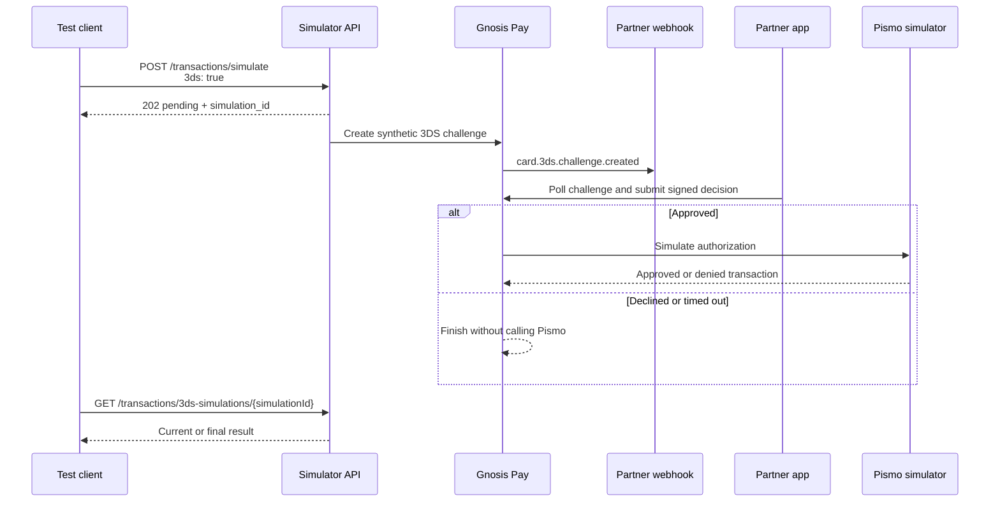

<Note>
  New to the sandbox environment? Read [Sandbox vs Production](/guides/configuring-environment) to understand more about sandbox environment.
</Note>

## Card Transaction Simulator

The Card Transaction Simulator allows you to test full card transaction lifecycles in the sandbox environment, without sending transactions to the live card network. It can also start an asynchronous in-app 3DS challenge before an authorization.

For a normal transaction request, the simulator:

1. The simulator authenticates the request
2. It checks available balance
3. It applies lifecycle logic:
   - **Authorization** creates a hold
   - **Reversal** releases a hold
   - **Replacement** adjusts an existing hold
   - **Clearing** confirms/settles a transaction
   - **Clearing Cancellation** cancels via clearing
4. It returns an approval or denial response with production-like fields

```
https://core.sandbox.gnosispay.in/docs/simulator-api
```


## How to Simulate a Card Transaction

<Steps>
  <Step title="Authenticate with the Simulator API">
    Use HTTP Basic Auth:
    - **Username:** `simulator`
    - **Password:** Provided during onboarding

    All simulator endpoints require authentication.
  </Step>

  <Step title="Choose the Card Identifier">
    You can simulate transactions using:
    - `card_id` → `POST /transactions/simulate`
    - `pan` → `POST /transactions/simulate-by-pan`

    Both endpoints behave identically.
  </Step>

  <Step title="Understand Request Fields">
    All simulation requests use these fields:

    | Field | Type | Required | Description |
    |---|---|---|---|
    | `transaction_type` | string | Yes | `authorization`, `reversal`, `replacement`, `clearing`, or `clearing_cancellation` |
    | `card_id` | uuid | Yes* | Card UUID (use `pan` instead on the by-PAN endpoint) |
    | `pan` | string | Yes* | Card PAN (only on the by-PAN endpoint) |
    | `amount` | string | Yes | Amount in major units (e.g., `"100.50"`) |
    | `currency` | string | Yes | `USD`, `EUR`, or `GBP` |
    | `authorization_code` | string | Conditional | Required for `reversal`, `replacement`, `clearing`, and `clearing_cancellation` |
    | `replacement_amount` | string | Conditional | Required for `replacement` |
    | `merchant_name` | string | No | Defaults to `"TEST MERCHANT"` |
    | `merchant_code` | string | No | MCC code. Defaults to `"5541"` |
    | `3ds` | boolean | No | When `true`, starts the asynchronous in-app 3DS flow before an authorization. Omitted or `false` keeps the normal synchronous behavior. |
  </Step>
</Steps>

## Transaction Types

The simulator supports five transaction types that form a complete lifecycle: **authorization**, **reversal**, **replacement**, **clearing**, and **clearing cancellation**.

### Simulate an Authorization

Authorization creates an initial hold on the card balance.

<Steps>
  <Step title="Send Authorization Request">
```json
{
  "transaction_type": "authorization",
  "card_id": "a1b2c3d4-e5f6-7890-abcd-ef1234567890",
  "amount": "100.50",
  "currency": "USD"
}
```

    **Required:** `transaction_type`, `amount`, `currency`, and `card_id` or `pan`.
  </Step>

  <Step title="Simulator Validation">
    The simulator will:
    - Confirm the card exists
    - Verify the card is active
    - Check sufficient available balance
    - Place a hold for the requested amount
  </Step>

  <Step title="Store Authorization Code">
    If approved, the response includes `authorization_code` and `authorization_id`.

    <Warning>
      **Save the `authorization_code`** as it's required for reversals, replacements, and clearing operations.
    </Warning>
  </Step>
</Steps>

## Test in-app 3DS

Set the optional `3ds` field to `true` to test the same integration your app uses for a real in-app 3DS challenge. The simulator creates a synthetic Apata challenge internally; it does not make a request to Apata. Partner webhook delivery, user API polling, EIP-712 wallet signing, and decision submission all use the normal integration path.



<Warning>
  `3ds: true` is supported only for `transaction_type: "authorization"` through `POST /transactions/simulate` with a `card_id`. It is not supported for reversals, replacements, clearing, clearing cancellation, by-PAN simulations, or named scenarios.
</Warning>

Before testing, the card must be active and Gnosis Pay must have enabled in-app 3DS and an active partner webhook for your sandbox tenant.

<Steps>
  <Step title="Start the simulation">
    Authenticate with the Simulator API and send:

    ```json
    {
      "transaction_type": "authorization",
      "card_id": "a1b2c3d4-e5f6-7890-abcd-ef1234567890",
      "amount": "1.00",
      "currency": "USD",
      "merchant_name": "SANDBOX 3DS TEST",
      "merchant_code": "5732",
      "3ds": true
    }
    ```

    The simulator request amount is expressed in major units and must be greater than zero. The generated 3DS challenge exposes the equivalent minor-unit integer string and its decimal exponent; for example, `"1.00"` USD becomes `amount: "100"` and `decimals: 2`.
  </Step>

  <Step title="Save the asynchronous simulation ID">
    The simulator returns `202 Accepted` instead of the normal synchronous transaction response:

    ```json
    {
      "simulation_id": "0195f62d-cbbb-7dd8-8d34-f6e46460a558",
      "status": "pending",
      "expires_at": "2026-09-24T15:05:00Z"
    }
    ```

    The synthetic challenge expires five minutes after the simulation starts.
  </Step>

  <Step title="Handle the challenge through your integration">
    Your partner webhook receives `card.3ds.challenge.created`. Your app can also discover the challenge through `GET /user-api/3ds/challenges`.

    Follow the normal flow in [In-App 3DS Push Provisioning](/guides/cards/card-3ds): show the challenge, request the decision-bound EIP-712 data, have the cardholder sign it, and submit the signed approval or decline. The simulator does not provide a shortcut around wallet proof.
  </Step>

  <Step title="Poll the simulation">
    Use Simulator API Basic Auth to request:

    ```
    GET /transactions/3ds-simulations/{simulationId}
    ```

    Continue until the simulation reaches a terminal state.
  </Step>
</Steps>

### 3DS simulation statuses

| Status | Meaning |
|---|---|
| `pending` | The challenge was created and is waiting for a decision. |
| `processing` | A signed decision was accepted and is being processed. |
| `completed` | The decision was approved and the Pismo simulator returned a transaction result. |
| `declined` | The cardholder declined. Pismo was not called. |
| `expired` | No decision was received within five minutes. Pismo was not called. |
| `failed` | Challenge delivery, configuration, or downstream processing failed. See the bounded `error` field. |

After approval, a completed response includes the normal Pismo result under `transaction`:

```json
{
  "simulation_id": "0195f62d-cbbb-7dd8-8d34-f6e46460a558",
  "status": "completed",
  "expires_at": "2026-09-24T15:05:00Z",
  "challenge_id": "0195f62d-cbe5-79da-b8ce-c981920a3af3",
  "transaction": {
    "status": "approved",
    "authorization_code": "ABC123",
    "authorization_id": 98765432,
    "authorization_date_time": "2026-09-24T15:01:00Z",
    "settlement_amount": "1.00",
    "mode_type": "DEBIT",
    "card_mode": "DEBIT",
    "is_domestic_transaction": true
  }
}
```

<Note>
  Funds are not required to test challenge delivery, polling, signing, decline, or timeout. Sufficient available balance is required only for the Pismo authorization after an approval. Without it, the simulation still reaches `completed`, but `transaction.status` is `denied`, usually with denial code `810` (`Insufficient balance`). You can fund the account before deciding through `POST /ledger/top-up`; use the `accountId` from the challenge and the account's supported currency.
</Note>

### Simulate a Reversal

Reversal cancels a previous authorization entirely and releases the held amount.

<Steps>
  <Step title="Provide Authorization Code">
    You must use the `authorization_code` returned from the original authorization.
  </Step>

  <Step title="Send Reversal Request">
```json
{
  "transaction_type": "reversal",
  "card_id": "a1b2c3d4-e5f6-7890-abcd-ef1234567890",
  "amount": "100.50",
  "currency": "USD",
  "authorization_code": "ABC123"
}
```
  </Step>

  <Step title="Simulator Behavior">
    The simulator will:
    - Validate the original authorization exists
    - Confirm the amount matches
    - Release the full held balance
  </Step>
</Steps>

### Simulate a Replacement

Replacement adjusts a previous authorization to a different amount.

<Steps>
  <Step title="Provide Authorization Code">
    Use the `authorization_code` from the original authorization.
  </Step>

  <Step title="Send Replacement Request">
```json
{
  "transaction_type": "replacement",
  "card_id": "a1b2c3d4-e5f6-7890-abcd-ef1234567890",
  "amount": "100.50",
  "currency": "USD",
  "authorization_code": "ABC123",
  "replacement_amount": "75.00"
}
```

    **Required:** `authorization_code` and `replacement_amount`.
  </Step>

  <Step title="Simulator Behavior">
    The simulator will:
    - Validate the original authorization
    - Reduce or increase the held amount
    - Update the balance accordingly
  </Step>
</Steps>

### Simulate a Clearing

Clearing confirms a previous authorization (settlement/Base II) and finalizes the transaction.

<Steps>
  <Step title="Provide Authorization Code">
    Use the `authorization_code` from the original authorization.
  </Step>

  <Step title="Send Clearing Request">
```json
{
  "transaction_type": "clearing",
  "card_id": "a1b2c3d4-e5f6-7890-abcd-ef1234567890",
  "amount": "100.50",
  "currency": "USD",
  "authorization_code": "ABC123"
}
```
  </Step>

  <Step title="Simulator Behavior">
    The simulator will:
    - Validate the original authorization
    - Process the settlement
    - Finalize the transaction

    <Warning>
      The simulator requires a minimum 2-minute gap between clearing messages for the same authorization. Sending a second clearing before this window elapses will result in a `409` error.
    </Warning>
  </Step>
</Steps>

### Simulate a Clearing Cancellation

Clearing cancellation cancels a transaction via clearing. For partial cancellation, send an amount lower than the original authorization.

<Steps>
  <Step title="Provide Authorization Code">
    Use the `authorization_code` from the original authorization.
  </Step>

  <Step title="Send Clearing Cancellation Request">
```json
{
  "transaction_type": "clearing_cancellation",
  "card_id": "a1b2c3d4-e5f6-7890-abcd-ef1234567890",
  "amount": "100.50",
  "currency": "USD",
  "authorization_code": "ABC123"
}
```
  </Step>

  <Step title="Simulator Behavior">
    The simulator will:
    - Validate the original authorization
    - Process the cancellation
    - Adjust balances accordingly

    <Note>
      For partial cancellations, use an amount lower than the original authorization amount.
    </Note>
  </Step>
</Steps>

## Response Handling

### Approved (Authorization)

An approved authorization response includes full transaction details:

```json
{
  "status": "approved",
  "authorization_code": "ABC123",
  "authorization_id": 98765432,
  "authorization_date_time": "2025-06-15T14:30:00Z",
  "settlement_amount": "100.50",
  "mode_type": "DEBIT",
  "card_mode": "CHIP",
  "is_domestic_transaction": true
}
```

### Approved (Clearing / Clearing Cancellation)

Clearing responses are sparse as most fields will be empty or zero-valued:

```json
{
  "status": "approved",
  "authorization_code": "",
  "authorization_id": 0,
  "authorization_date_time": "0001-01-01T00:00:00Z",
  "settlement_amount": "",
  "mode_type": "",
  "card_mode": "",
  "is_domestic_transaction": false
}
```

### Denied

If denied, the response includes detailed denial information:

```json
{
  "status": "denied",
  "authorization_code": "",
  "authorization_id": 98765432,
  "authorization_date_time": "2025-06-15T14:30:00Z",
  "settlement_amount": "0.00",
  "mode_type": "DEBIT",
  "card_mode": "CHIP",
  "is_domestic_transaction": true,
  "denial_code": "810",
  "denial_reason": "Insufficient balance"
}
```

<Note>
  `denial_code` and `denial_reason` use the same codes documented in [Card Decline Reasons](/concepts/card/decline-codes), use the simulator to test the responses and showcase the right mapping according to the guide.
</Note>

## Error Handling

Validation and authentication errors return structured error objects:

```json
{
  "code": 400,
  "message": "authorization_code is required for reversal, replacement, and clearing transactions"
}
```

**Possible HTTP status codes:**

| Status | Cause |
|--------|-------|
| `401` | Invalid credentials |
| `400` | Validation error (missing fields, invalid amount/currency) |
| `404` | Card or account not found |
| `409` | Clearing collision — a clearing message is already being processed for this authorization. Wait at least 2 minutes between clearing messages |
