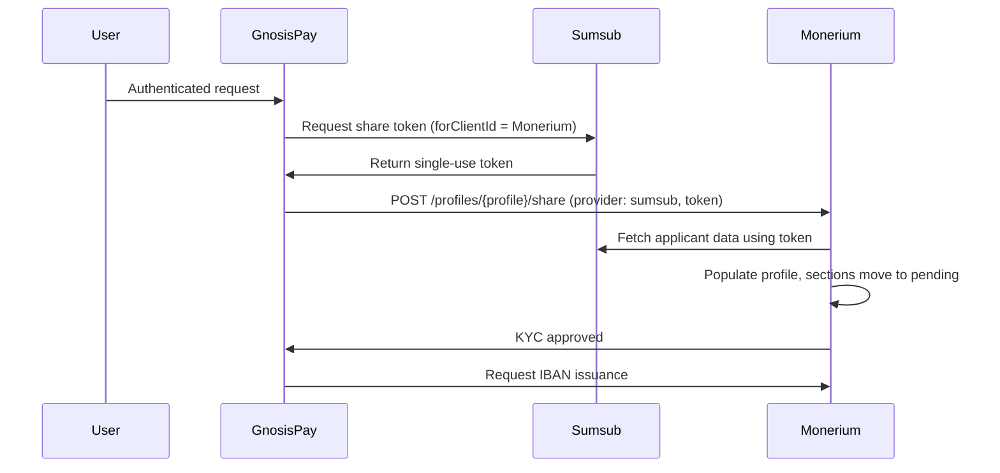

<Note>
  Before starting, read [KYC Sharing (Sumsub Flow)](/guides/kyc-sharing/pass-kyc) as this guide builds directly on the share-token flow described there.
</Note>

Gnosis Pay integrates with **Monerium** to offer users an IBAN linked to their account. Rather than requiring the user to complete KYC a second time with Monerium, their already-verified Sumsub identity data can be shared directly with Monerium, which reuses it to populate and verify the user's Monerium profile.

Monerium is configured as a Sumsub **recipient** on our end, meaning your integration flow requests a Sumsub share token scoped specifically for Monerium's client ID, then forwards that token to Monerium.

## How it works

<Steps>
  <Step title="Request a Sumsub share token for Monerium">
    Call [`POST /kyc/import-partner-applicant`](/api-reference/kyc/generate-kyc-applicant-share-token) with `forClientId` set to Monerium's Sumsub client ID.

    <Tabs>
      <Tab title="Sandbox">
```bash
        curl --request POST \
          --url https://core.sandbox.gnosispay.in/user-api/kyc/import-partner-applicant \
          --header 'Authorization: Bearer <token>' \
          --header 'Content-Type: application/json' \
          --data '{
            "forClientId": "<monerium_sumsub_client_id>",
            "ttlInSecs": 1200
          }'
```
      </Tab>
      <Tab title="Production">
```bash
        curl --request POST \
          --url https://core.prod.gnosispay.com/user-api/kyc/import-partner-applicant \
          --header 'Authorization: Bearer <token>' \
          --header 'Content-Type: application/json' \
          --data '{
            "forClientId": "<monerium_sumsub_client_id>",
            "ttlInSecs": 1200
          }'
```
      </Tab>
    </Tabs>

    The response returns a single-use `token`:

```json
    {
      "token": "<string>",
      "forClientId": "<monerium_sumsub_client_id>"
    }
```

    <Warning>
      This token is single-use and expires after `ttlInSecs` (default 1200 seconds). Request a fresh token immediately before passing it to Monerium, don't generate it ahead of time and store it.
    </Warning>
  </Step>

  <Step title="Share the token with Monerium">

     <Info>
      This call is made directly to Monerium's API using your own Monerium partner credentials (`BearerAuth`) not a Gnosis Pay endpoint. Note Monerium's sandbox uses `.dev` (fake money) and production uses `.app` (real money),this differs from Gnosis Pay's own `.sandbox` / `.prod` domain pattern, so don't mix them up.
    </Info>

    Pass the `token` from Step 1 to [Monerium's Share KYC Data endpoint](https://docs.monerium.com/api/#tag/profiles/operation/share-profile-kyc), under the `personal` object, with `provider` set to `"sumsub"`.

    <Tabs>
      <Tab title="Sandbox">
```bash
        curl --request POST \
          --url "https://api.monerium.dev/profiles/{profile}/share" \
          --header 'Authorization: Bearer <monerium_bearer_token>' \
          --header 'Accept: application/vnd.monerium.api-v2+json' \
          --header 'Content-Type: application/json' \
          --data '{
            "provider": "sumsub",
            "personal": {
              "token": "<sumsub_share_token>"
            }
          }'
```
      </Tab>
      <Tab title="Production">
```bash
        curl --request POST \
          --url "https://api.monerium.app/profiles/{profile}/share" \
          --header 'Authorization: Bearer <monerium_bearer_token>' \
          --header 'Accept: application/vnd.monerium.api-v2+json' \
          --header 'Content-Type: application/json' \
          --data '{
            "provider": "sumsub",
            "personal": {
              "token": "<sumsub_share_token>"
            }
          }'
```
      </Tab>
    </Tabs>

    Monerium uses the supplied token to fetch the user's data directly from Sumsub and populates the relevant sections of the user's Monerium profile. Each section that receives sufficient data transitions to `pending`; any section that remains incomplete stays `incomplete`.


  </Step>

  <Step title="Data reaches Monerium">
    Once Monerium has ingested the shared KYC data, the relevant sections of the user's profile move to `pending` review on Monerium's side. No further action is needed from your integration until Monerium's review completes.
  </Step>

  <Step title="Request IBAN issuance">
    Once the profile's KYC sections are approved by Monerium, you can request IBAN issuance directly through Monerium's own API.

    <Note>
      See Monerium's own API reference for the IBAN issuance endpoint, this is a separate call from KYC sharing above.
    </Note>
  </Step>
</Steps>

## Summary


