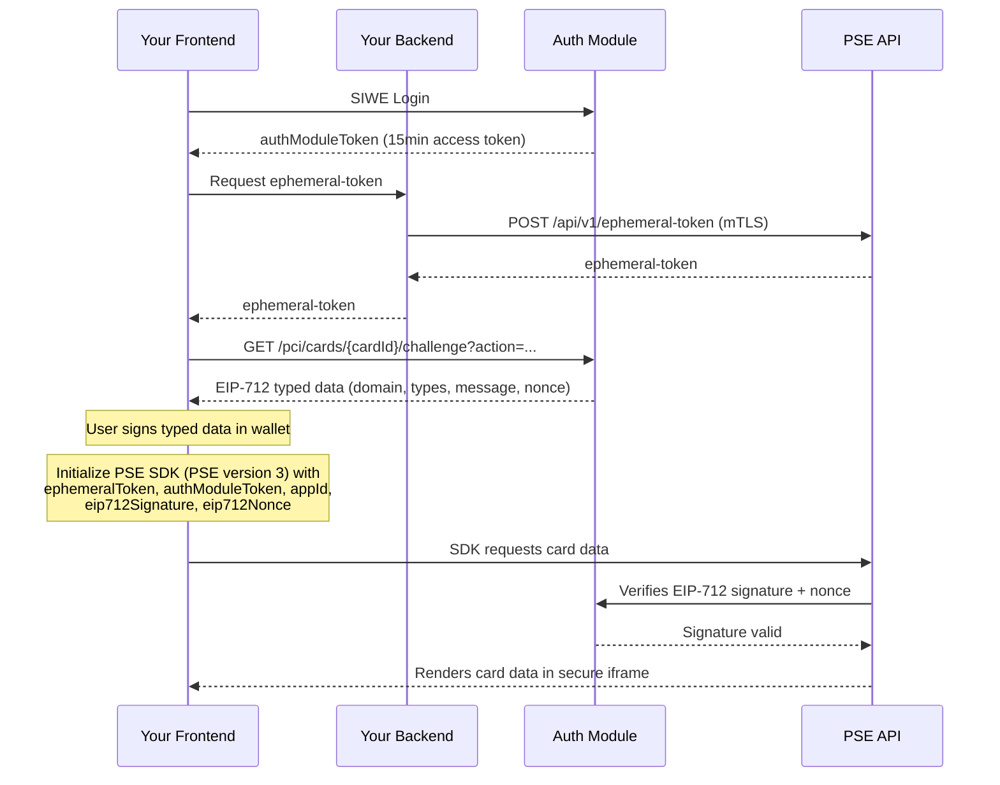

## Overview

If you want to display sensitive information (such as card numbers or PINs) in your front-end, you'll need to interact with our **Partner Secure Elements (PSE)** service. The easiest way to do this is by using the [PSE SDK](https://www.npmjs.com/package/@gnosispay/pse-sdk) from Gnosis Pay.

To initialize the SDK, you'll need:
- An `App ID` provided to you upon registration with Gnosis Pay
- An **ephemeral-token** retrieved from the PSE private API using mTLS authentication
- An **auth module token** obtained through the [SIWE authentication flow](/v2/v2-siwe-auth)
- An **EIP-712 signature** and **nonce** obtained from the challenge flow described below

<Info>
  **PSE version 3** adds an EIP-712 wallet signature as a second factor for every sensitive operation. Pass `pseVersion: 3` when constructing the SDK and include `eip712Signature` and `eip712Nonce` obtained from the challenge flow described below.

  Note: `pseVersion` refers to the PSE SDK protocol version and is unrelated to the Gnosis Pay API path (which remains `/v2`).
</Info>

<Warning>
  **Backend Required**: mTLS authentication can only be performed from a
  back-end. You need a back-end responsible for retrieving the
  ephemeral-token and sending it to your front-end upon request. We'll go
  through each step in this guide.
</Warning>

Once your front-end has the ephemeral-token and auth module token, it can initialize the PSE SDK and use it to display secure elements.

Here's a diagram showing each step:

---
