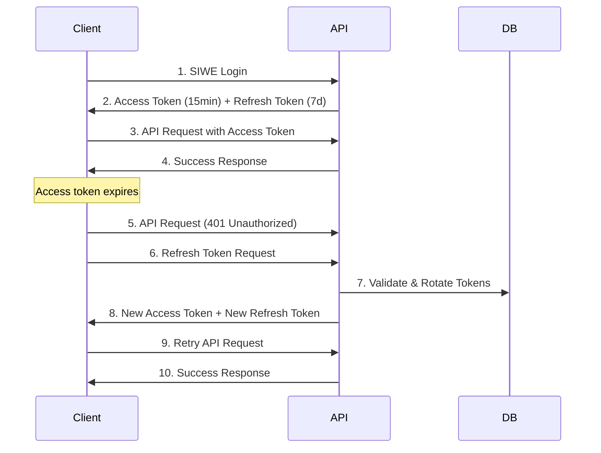

As part of the Gnosis Pay V2 integration, we are introducing a more secure authentication mechanism. V2 authentication utilizes a token-based system with **access tokens** and **refresh tokens**, replacing the previous long-lived JWT approach. We now provide short-lived access tokens (15 minutes) paired with long-lived refresh tokens (7 days) for enhanced security. This guide will walk you through implementing the new authentication flow in your application.

### Token Types

| Property | Access Token | Refresh Token |
|----------|-------------|---------------|
| **Lifespan** | 15 minutes | 7 days |
| **Type** | Stateless JWT | Opaque token (secure random string) |
| **Purpose** | Used for API requests and contains user claims | Used to obtain new access tokens when they expire |
| **Storage** | Memory or short-term storage (not localStorage) | Secure, encrypted storage on the user’s device (must be handled securely by the application)|


### Authentication Flow



## Authentication Flow

Let's take a look at how you can complete SIWE validation and retrieve access tokens.

<Steps>
    <Step title = "Get SIWE Message to sign">
    Request a SIWE message by calling the endpoint with the wallet address in the path and required query parameters.

    <Note>
    **Domain Whitelisting Required**: We validate domains on our end for security. Your SIWE message must originate from a domain that has been pre-approved and whitelisted in our system. Contact our team to whitelist your domain before implementing authentication.
    </Note>

        See full specification: [GET /auth/siwe/{address}](/api-reference/auth/get-siwe-message)


        <Tabs>
        <Tab title="Sandbox">
        ```bash
        curl --request GET \
          --url https://gp-auth-module.sandbox.gnosispay.in/auth/siwe/{address}?domain=&uri=&appName=
        ```
        </Tab>
        </Tabs>
    </Step>

    <Step title="Get Access and Refresh Token">
        Submit the signed SIWE message to verify authentication and receive your token pair. Send the wallet address, signature from the user's wallet, and the original SIWE message to get both access and refresh tokens.

        See full specification: [POST /auth/siwe](/api-reference/auth/get-access-token)

        <Tabs>
        <Tab title="Sandbox">
        ```bash
        curl --request POST \
          --url https://gp-auth-module.sandbox.gnosispay.in/auth/siwe \
          --header 'Content-Type: application/json' \
          --data '{
              "address": "<string>",
              "signature": "<string>",
              "message": "<string>"
          }'
        ```
        </Tab>
        </Tabs>

         <Warning>
            **Secure Storage Required**: Store the refresh token securely to prevent XSS attacks. While our system has mechanisms to invalidate sessions if tokens are compromised, developers must implement proper security measures and secure storage APIs to protect against client-side vulnerabilities.
        </Warning>
    </Step>

    <Step title="Refresh Access Token">
        Exchange a valid refresh token for a new access token and rotated refresh token. This should be called automatically when your access token expires (every 15 minutes) or when you receive a 401 response.

        See full specification: [POST /auth/refresh](/api-reference/auth/refresh-access-token)

        <Tabs>
        <Tab title="Sandbox">
        ```bash
        curl --request POST \
          --url https://gp-auth-module.sandbox.gnosispay.in/auth/refresh \
          --header 'Content-Type: application/json' \
          --data '{
            "refreshToken": "your_refresh_token_here"
          }'
        ```
        </Tab>
        </Tabs>
        <Info>
          **Token Rotation**: Each refresh request invalidates the previous refresh token and issues a new one. Always store the new refresh token from the response for subsequent refresh requests.
        </Info>
        <Warning>
        The refresh token should only be used once. If a refresh token is used twice, the user will be automatically logged out. Preventing race conditions is essential to maintain session integrity.
        </Warning>
        </Step>
</Steps>

### Revoking access tokens

   To securely log out a user, revoke their current session by invalidating all refresh tokens in the token family.

   <Warning>
     After successful logout, remove the refresh token from your client's secure storage to complete the logout process.
   </Warning>

    See full specification: [POST /auth/logout](/api-reference/auth/logout)

    <Tabs>
    <Tab title="Sandbox">
    ```bash
    curl --request POST \
      --url https://gp-auth-module.sandbox.gnosispay.in/auth/logout \
      --header 'Content-Type: application/json' \
      --data '{
        "refreshToken": "your_refresh_token_here"
      }'
    ```
    </Tab>
    </Tabs>
